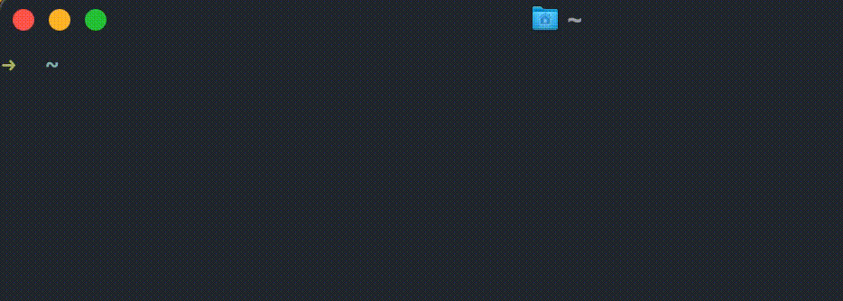

# MugiKuru Command



This is a test program where my household cat appears in the console.
And the previous screen in the console may require you to scroll up quite a bit to see it.

P.S. Don’t forget to give your real cat plenty of love too!

## Install

```sh
go build -o mugikuru
mv mugikuru /usr/local/bin
```

## Usage

```sh
mugikuru
```
